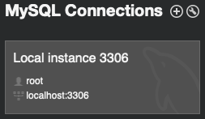

The following is a method I've found that works to create a MySQL database directly from a Python program. 

I recommend that you have [MySQL Workbench](https://dev.mysql.com/downloads/workbench/){:target="\_blank"} installed on your machine. I've seen a lot of tutorials that work with MySQL have you download MySQL _Server_ as well but it's definitely not needed and in my experience, MySQL Server just adds complexity that isn't necessary to suffer through. 

MySQL Workbench is an IDE specifically to design and create databases with ease and is indeed super easy to use. For this tutorial, it will simply serve as test verification when we create the database with Python. We'll be able to see the results over in MySQL Workbench.

I've been using [python-poetry](https://python-poetry.org/){:target="\_blank"} as my Python package manager for a few years now, and will be using that and Visual Studio Code for my text editor. 

## MySQL Connector

Once you have your project set up and are ready to create your database in your Python dev environment, you'll need to download a Python package called [mysql-connector-python](https://pypi.org/project/mysql-connector-python/){:target="\_blank"}.

From your command line, run:

```py
poetry add mysql-connector-python 
```

Create a file in your project called `database.py`  and save the following code to it:

```py
import mysql.connector

config = {
    'user': 'root',
    'password': 'yourpassword',
    'host': 'localhost'
}

db = mysql.connector.connect(**config)
cursor = db.cursor()
```

The `password` value will need to be your password that you set up when you downloaded MySQL Workbench. 

Create another file in your project called `setup.py` and save the following to it:

```py
import mysql.connector
from database import cursor

DB_NAME = 'acme'

def create_database():
    cursor.execute(f"CREATE DATABASE IF NOT EXISTS {DB_NAME} DEFAULT CHARACTER SET 'utf8'")
    print(f"Database {DB_NAME} has been created!")

create_database()
```

The `database.py` file is the config file that establishes the connection with a MySQL localhost server. 

The `setup.py` file is where we actually create the schema.

Once you have the code above (or something like it) saved in your project, run the `setup.py` file and if all went according to plan, you should have gotten output in your terminal window with the `print()` method's affirmation that your database has been created. 

Open up MySQL Workbench and you should see a welcome message when it starts up as well as a section labeled _MySQL Connections_. Click on the box that looks like so:



If all went well, you should have a brand new database that you created with Python.


