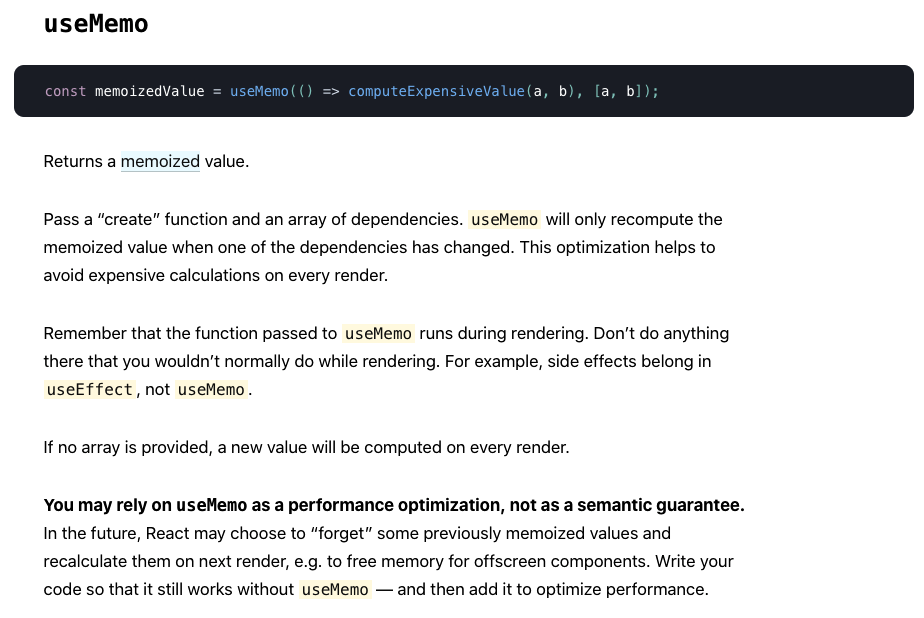
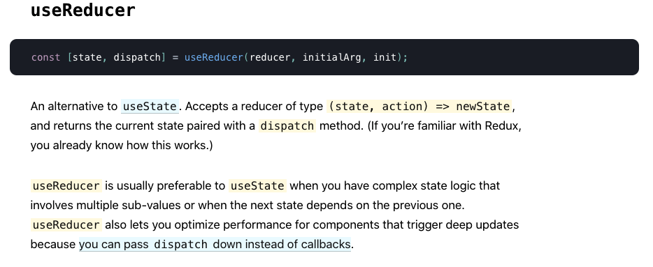

# Context API

1. Describe use cases for useMemo() and useReducer()
   
   
2. Why do custom hooks need the use prefix?
   - A custom Hook is a JavaScript function whose name starts with ”use” and that may call other Hooks. Its name should always start with **use** so that you can tell at a glance that the rules of Hooks apply to it.
   - This convention is very important. Without it, react wouldn’t be able to automatically check for violations of rules of Hooks because react couldn’t tell if a certain function contains calls to Hooks inside of it.
3. What do custom hooks usually do?
   - Custom Hooks offer the flexibility of sharing logic that wasn’t possible in React components before. You can write custom Hooks that cover a wide range of use cases like form handling, animation, declarative subscriptions, timers, and probably many more we haven’t considered. What’s more, you can build Hooks that are just as easy to use as React’s built-in features.
4. Using any list of custom hooks, research and name one that you think will be useful in your applications
5. Describe how a hook that fetches API data might work

   - You can use useEffect() with async/await workarounds to fetch API data. The following are three known ways to make an API call utilizing useEffect():

     **_Async method 1 is REACT recommended_**

     ```
     useEffect(() => {
     const search = async () => {
     const { data } = await axios.get('https://en.wikipedia.org/w/api.php', {
       params: {
         action: 'query',
         list: 'search',
         origin: '*',
         format: 'json',
         srsearch: term
       }
     });
     setResults(data.query.search);
     }
     if (term) {
     search();
     }
     }, [term]);
     ```

     ```
     (async () => {
     await
     axios.get('stuff');
     })();
     ```

     ```
     axios.get('stuff')
     .then((data) => {console.log(response.data)})
     ```

### Vocab

- [reducer](https://reactjs.org/docs/hooks-reference.html#usereducer)
  - An alternative to useState()
  - Accepts a reducer type (state, action) => newState and returns the current state paired with a dispatch method.
  - useReducer is usually preferable to useState when you have comlex state logic that involves multi-sub-values or when the next state depends on the previous one.
  - also lets you optimize performance for components that trigger deep updates because you can pass dispatch down instead of callbacks

#### Materials

- [context api](https://reactjs.org/docs/context.html)
  [hooks and context example](https://medium.com/swlh/snackbars-in-react-an-exercise-in-hooks-and-context-299b43fd2a2b)
  [react context links](https://github.com/diegohaz/awesome-react-context)

 (../index.md)
